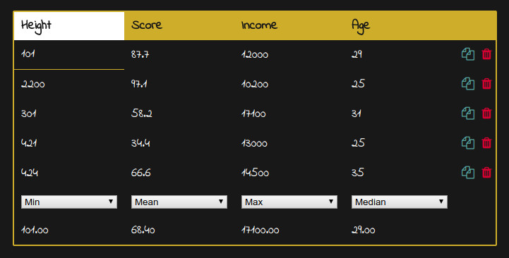

# uomtable
Simple JavaScript Library for table editing, written in ES6.

# Instructions
Add uomTables.js to your html file and add the class uomTable to your table.

# Example
```html
<!DOCTYPE html>
<html>
<body>
<table id="uomTable" class="uomTable">
	<thead>
		<tr><td>Height</td><td>Score</td><td>Income</td><td>Age</td></tr>
	</thead>
	<tbody>
		<tr><td>101</td><td>87.7</td><td>12000</td><td>29</td></tr>
		<tr><td>2200</td><td>97.1</td><td>10200</td><td>25</td></tr>
		<tr><td>301</td><td>58.2</td><td>17100</td><td>31</td></tr>
		<tr><td>421</td><td>34.4</td><td>13000</td><td>25</td></tr>
		<tr><td>424</td><td>66.6</td><td>14500</td><td>35</td></tr>
	</tbody>
	<tfoot>
	</tfoot>
</table>
<script src="src/uomTables.js"></script>
</body>
</html>
```

# Preview

